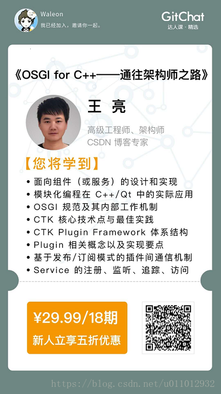

值得庆幸的是，在 C++ 中也有类似的框架 - CTK Plugin Framework。它借鉴了 OSGI 的思想，并实现了几乎完整的 OSGI 框架 API！

在通往架构师的道路上，不仅需要了解面向组件（或服务）的设计和实现，更应当了解其背后的原理。本课程，我们将主要围绕 CTK，探索 C++ 中的模块化技术。希望通过分享的知识，大家能够了解 OSGI 内部的工作机制，并能够基于 CTK 快速搭建 C++ 组件化框架。

## 课程介绍

OSGI 技术是面向 Java 的动态模型系统。Java 圈子里有非常著名的一句话：OSGI - 架构师的天堂。换句话说，OSGI 能让软件开发变得更加容易！

值得庆幸的是，在 C++ 中也有类似的框架 - CTK Plugin Framework。它借鉴了 OSGI 的思想，并实现了几乎完整的 OSGI 框架 API！

在通往架构师的道路上，不仅需要了解面向组件（或服务）的设计和实现，更应当了解其背后的原理。本课程，我们将主要围绕 CTK，探索 C++ 中的模块化技术。希望通过分享的知识，大家能够了解 OSGI 内部的工作机制，并能够基于 CTK 快速搭建 C++ 组件化框架。

{:data-width="1920" data-height="1260"}
订购本课程，可获得专属海报。
{:.figure}

<b>凡是购买了课程的童鞋，请私聊我，福利多多 ^_^。</b>

<b>| </b>版权声明：一去、二三里，未经博主允许不得转载。

## 课程内容

本课程共包含四大部分：

- 第一部分（第 01-03 课）：入门篇，初步了解，包括框架选择标准、OSGI 和 CTK 之间的关系、CTK 的优势解析及基础初探。
- 第二部分（第 04-10 课）：进阶篇，开始使用，包括开发环境的搭建，CTK 的编译、插件的创建、以及如何在程序中嵌入插件框架等功能。
- 第三部分（第 11-17 课）：高级篇，掌握核心，CTK 事件管理机制、日志管理、服务追踪、事件与监听等功能。
- 第四部分（第 18 课）：总结篇 ，FAQ 常见问题，针对 CTK 中的常见问题进行快速分析，并给出最合理的解决方案。

以下是各个部分的具体内容，以及示例源码：

课程地址 | 示例源码
:--- | :---
[《第 01 课：入门篇 - 初识 CTK》](http://gitbook.cn/gitchat/column/5ad02029f8164454a34a089b/topic/5ad03d99f8164454a34a12b1) | ---
[《第 02 课：入门篇 - 漫谈 CTK》](http://gitbook.cn/gitchat/column/5ad02029f8164454a34a089b/topic/5ad041adf8164454a34a13c0) | ---
[《第 03 课：入门篇 - CTK Plugin Framework 基本原理》](http://gitbook.cn/gitchat/column/5ad02029f8164454a34a089b/topic/5ad04402f8164454a34a148a) | ---
[《第 04 课：进阶篇 - 编译 CTK》](http://gitbook.cn/gitchat/column/5ad02029f8164454a34a089b/topic/5ad04605f8164454a34a152e) | ---
[《第 05 课：进阶篇 - 使用 CTKWidgets》](http://gitbook.cn/gitchat/column/5ad02029f8164454a34a089b/topic/5ad046dff8164454a34a1582) | UseCTKWidgets
[《第 06 课：进阶篇 - Hello，CTK！》](http://gitbook.cn/gitchat/column/5ad02029f8164454a34a089b/topic/5ad047cbf8164454a34a15cb) | HelloCTK
[《第 07 课：进阶篇 - 在程序中嵌入 CTK Plugin Framework》](http://gitbook.cn/gitchat/column/5ad02029f8164454a34a089b/topic/5ad04887f8164454a34a1624) | EmbedCTK
[《第 08 课：进阶篇 - CTK 插件元数据》](http://gitbook.cn/gitchat/column/5ad02029f8164454a34a089b/topic/5ad050eff8164454a34a194f) | GetMetaData
[《第 09 课：进阶篇 - CTK 插件和服务》](http://gitbook.cn/gitchat/column/5ad02029f8164454a34a089b/topic/5ad05118f8164454a34a1965) | PluginAndService
[《第 10 课：进阶篇 - CTK 插件之间的依赖》](http://gitbook.cn/gitchat/column/5ad02029f8164454a34a089b/topic/5ad05132f8164454a34a196c) | RequirePlugin
[《第 11 课：高级篇 - CTK 事件管理机制（上）》](http://gitbook.cn/gitchat/column/5ad02029f8164454a34a089b/topic/5ad0521bf8164454a34a19c4) | ---
[《第 12 课：高级篇 - CTK 事件管理机制（中）》](http://gitbook.cn/gitchat/column/5ad02029f8164454a34a089b/topic/5ad05231f8164454a34a19c9) | EventAdmin/SendEvent
[《第 13 课：高级篇 - CTK 事件管理机制（下）》](http://gitbook.cn/gitchat/column/5ad02029f8164454a34a089b/topic/5af3e5fa38c1ac1d8df9bfef) | EventAdmin/SignalSlot
[《第 14 课：高级篇 - CTK 服务工厂》](http://gitbook.cn/gitchat/column/5ad02029f8164454a34a089b/topic/5ad0524af8164454a34a19cf) | ServiceFactory
[《第 15 课：高级篇 - CTK 事件与监听》](http://gitbook.cn/gitchat/column/5ad02029f8164454a34a089b/topic/5ad05289f8164454a34a19f5) | EventListener
[《第 16 课：高级篇 - CTK 服务追踪》](http://gitbook.cn/gitchat/column/5ad02029f8164454a34a089b/topic/5ad06843f8164454a34a22dd) | ServiceTracker
[《第 17 课：高级篇 - 访问 CTK 服务的最佳方式》](http://gitbook.cn/gitchat/column/5ad02029f8164454a34a089b/topic/5ad0685bf8164454a34a22e3) | ---
[《第 18 课：总结 FAQ》](http://gitbook.cn/gitchat/column/5ad02029f8164454a34a089b/topic/5ad06871f8164454a34a22ee) | ---

## 适宜人群

- C++/Qt 中高级开发工程师、架构师
- 专注于模块化协作的开发者
- 希望能快速掌握 CTK 的开发者

## 课程地址

各位小伙伴们，欢迎订购，请猛戳：

- 课程地址：[OSGI for C++ - 通往架构师之路](http://gitbook.cn/gitchat/column/5ad02029f8164454a34a089b)
- Github 示例源码： [CTK-examples](https://github.com/Waleon/CTK-examples "CTK-examples")

[blog]: https://hydejack.com/blog/
[portfolio]: https://hydejack.com/projects/
[resume]: https://hydejack.com/resume/
[download]: https://hydejack.com/download/
[welcome]: https://hydejack.com/
[forms]: https://hydejack.com/forms-by-example/

[features]: #features
[news]: #build-an-audience
[syntax]: #syntax-highlighting
[latex]: hydejack/_posts/2018-06-01-example-content-iii.md#math

[lic]: LICENSE.md
[pro]: licenses/PRO.md
[docs]: docs/README.md

[kit]: https://github.com/qwtel/hy-starter-kit/archive/v8.1.0.zip
[src]: https://github.com/qwtel/hydejack
[gem]: https://rubygems.org/gems/jekyll-theme-hydejack
[buy]: https://app.simplegoods.co/i/NATYVLYT

[gpss]: https://developers.google.com/speed/pagespeed/insights/?url=https%3A%2F%2Fhydejack.com%2F
[hy-push-state]: https://qwtel.com/hy-push-state/
[hy-drawer]: https://qwtel.com/hy-drawer/
[hy-img]: https://qwtel.com/hy-img/
[rouge]: http://rouge.jneen.net
[katex]: https://khan.github.io/KaTeX/
[tinyletter]: https://tinyletter.com/

*[FLIP]: First-Last-Invert-Play. A coding technique to achieve performant page transition animations.
